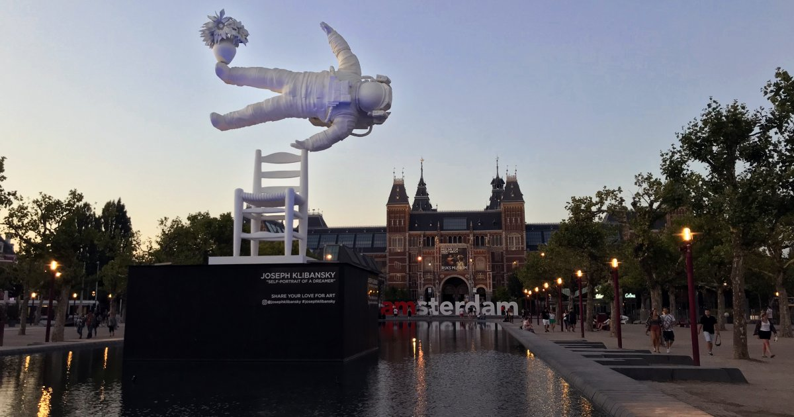

The sketches of Big Ben were my first attempt at inversion drawing. I wanted to rebel against the limits of traditional graphite pencil on paper and create sketches with dark nighttime backgrounds and brightly contrasted foreground subjects. For inversion drawings, I use normal graphite on paper but make light elements dark and shadows light (right), and then a photo editor to invert the colors afterwards (left).

In 2018, I visited the Rijks Museum in Amsterdam. In front of the Museum Quarter was a large pond, in which there was a huge statue of an astronaut seemingly floating above a chair, with a flower pot drifting upward in frozen motion.

This sculpture was Joseph Klibansky's "Self-Portrait of a Dreamer" and struck me with its unique subjects, captured movement, and unusual way of depicting a self-portrait. Some time after the trip, the sculpture's subjects drifted into my sketches, and I created this drawing.

The uninverted sketch:
