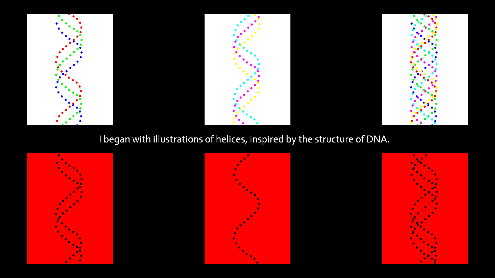
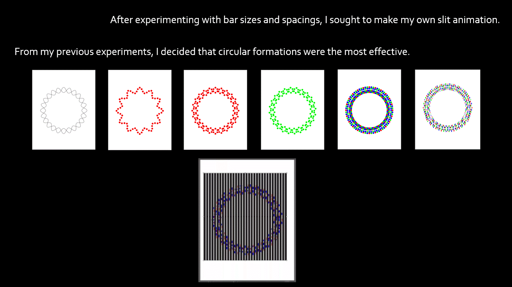
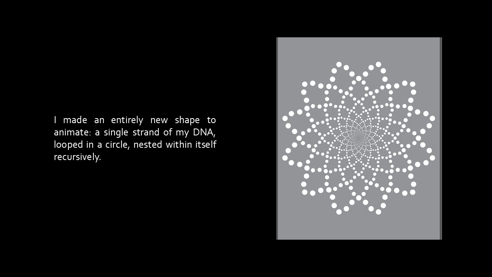

In this work, I explore two distinct artistic styles: op art and psychedelia. I sought to combine elements of both art movements into my project exploring RGB and CMYK color theory.

Firstly, I wanted to create an optical illusion in the style of the op art movement, which often utilizes black and white abstractions to give the impression of movement or warping patterns. To achieve apparent motion in the absence of real motion, I chose to incorporate slit animation, which is typically created in black and white.

Secondly, I hoped to utilize vibrant, full 256-value colors characteristic of the psychedelia movement to demonstrate the how each color model represents a full spectrum of colors. I explore the gradient effect created by each color model, when only its primary hues are present.

Then I changed the background to black, and things came together! Here were the results with RGB only:

CMY only:

Combined:

All three together: 
